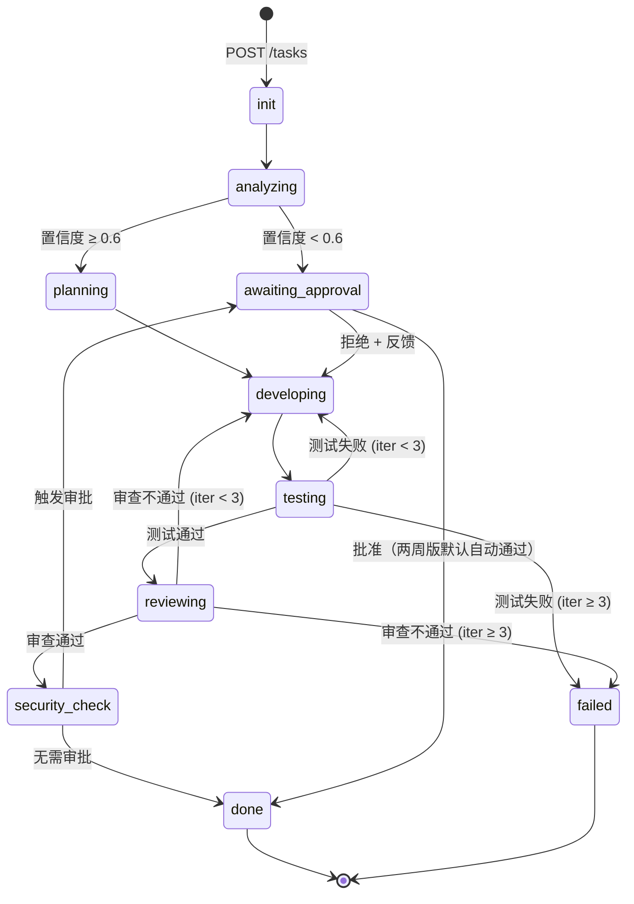

# DevFlow：基于 LangGraph 的面向软件工程的多 Agent 协同智能体开发

## 项目设计与开发方案文档（两周冲刺版）

| 项目 | 内容 |
|------|------|
| **项目名称** | DevFlow |
| **项目全称** | 基于 LangGraph 的面向软件工程的多 Agent 协同智能体开发 |
| **英文名称** | Multi-Agent Collaborative Intelligent Agent Development for Software Engineering Based on LangGraph |
| **文档版本** | v3.0（两周冲刺版） |
| **文档日期** | 2026-07-22 |
| **开发周期** | 14 天（高强度，含加班） |
| **团队规模** | 4 人 |
| **代码仓库** | D:\Dev\devflow |

---

## 目录

1. [项目概述](#1-项目概述)
2. [核心能力与范围裁剪](#2-核心能力与范围裁剪)
3. [系统架构设计](#3-系统架构设计)
4. [核心数据结构与接口契约](#4-核心数据结构与接口契约)
5. [Agent 体系设计](#5-agent-体系设计)
6. [工作流设计](#6-工作流设计)
7. [工具系统](#7-工具系统)
8. [沙箱与执行引擎](#8-沙箱与执行引擎)
9. [前端与评测平台](#9-前端与评测平台)
10. [团队角色与职责](#10-团队角色与职责)
11. [十四天开发计划](#11-十四天开发计划)
12. [协作规则与工程规范](#12-协作规则与工程规范)
13. [风险管理与降级方案](#13-风险管理与降级方案)
14. [成功标准与验收条件](#14-成功标准与验收条件)
15. [最终交付清单](#15-最终交付清单)
16. [附录](#16-附录)

---

## 1. 项目概述

### 1.1 项目背景

随着大语言模型（LLM）技术的快速发展，智能体（Agent）已从简单的对话系统演进为能够完成复杂任务规划、工具调用和自主决策的智能系统。在传统软件开发过程中，需求分析、代码编写、测试调试、代码审查等环节通常需要开发人员反复交互完成，存在以下痛点：

- **信息传递损耗**：需求 → 设计 → 编码各阶段之间存在理解偏差和重复沟通
- **重复工作多**：相似的 Bug 修复、代码审查模式反复出现，缺乏知识复用
- **流程割裂**：分析、开发、测试、审查各环节工具独立，缺乏统一的编排层
- **质量不可量化**：代码审查的深度、测试的有效性难以标准化评估

本项目面向软件工程开发场景，设计并实现一个基于 **LangGraph** 的多 Agent 协同智能体系统。系统模拟真实软件开发团队的协作模式，通过多个具有不同专业职责的 AI Agent 协同完成软件开发流程中的关键任务。

### 1.2 项目定义

**DevFlow** 是一个基于 LangGraph 的**可恢复、可评测、多 Agent 协同的软件交付平台**。

核心流程：

```
用户输入软件需求
       │
       ▼
  📋 需求分析 Agent    →  理解需求、识别范围、输出验收条件
       │
       ▼
  📝 方案规划 Agent    →  分析代码仓库、设计修改步骤、评估风险
       │
       ▼
  💻 代码开发 Agent    →  读取文件、生成 unified diff、应用 Patch
       │
       ▼
  🐳 沙箱测试执行      →  Docker 隔离环境、pytest 自动运行
       │
       ▼
  🔍 代码审查 Agent    →  代码质量检查 + 测试结果分析 + 安全风险标注
       │
       ▼
  ✅ 完成 / ❌ 返工     →  最多 3 次迭代
```

### 1.3 项目目标

| 目标维度 | 具体目标 |
|----------|---------|
| **多 Agent 协同** | 4 个专业 Agent 分工协作，非单一 Agent 完成所有任务 |
| **状态化工作流** | LangGraph 条件路由、Checkpoint 持久化、故障恢复 |
| **真实代码操作** | Agent 读取仓库、搜索文件、生成 diff、应用 Patch |
| **安全可执行** | Docker 沙箱隔离（无网络 + 资源限制） |
| **自动测试验证** | pytest 自动运行，结构化返回结果，失败触发返工 |
| **可量化评测** | 20 条可重复评测任务 + 单 Agent vs 多 Agent 对比 |

### 1.4 技术选型

| 层级 | 技术 | 选型理由 |
|------|------|----------|
| **工作流编排** | LangGraph | 原生 StateGraph、条件路由、Checkpoint |
| **后端 API** | FastAPI | 高性能异步、自动文档、SSE 支持 |
| **Agent 框架** | LangChain + LangGraph | 工具调用成熟、技术栈一致 |
| **LLM 后端** | DeepSeek / ChatAnywhere（免费/便宜） | 控制开发成本 |
| **持久化** | SQLite（零配置） | 开发期快速迭代 |
| **沙箱** | Docker | 成熟隔离、资源限制 |
| **前端** | React + TypeScript | 生态丰富 |
| **评测** | Python 脚本 | 灵活、可复现 |

---

## 2. 核心能力与范围裁剪

### 2.1 两周版保留的核心能力

| 能力 | 说明 |
|------|------|
| 🤖 **4 Agent 协同** | Requirement → Planner → Developer → Reviewer（Security 检查项并入 Reviewer） |
| 🔄 **LangGraph 编排** | 条件路由 + 返工循环（≤3次）+ Checkpoint 恢复 |
| 🛠️ **工具增强** | 文件读写、代码搜索、diff 生成、pytest 执行 |
| 🐳 **Docker 沙箱** | 网络隔离 + CPU/内存限制 + 超时控制 |
| 🧪 **自动测试** | pytest 结构化返回 + 失败分类（新增 vs 原有） |
| 📊 **可观测性** | Agent 调用记录（Token/耗时/决策理由）+ 前端展示 |
| 📈 **评测对比** | 20 条任务 + 单 Agent vs 多 Agent 两组实验 |

### 2.2 相比六周版裁剪的内容

| 裁剪项 | 原因 | 如何处理 |
|--------|------|---------|
| Security Agent（独立） | 安全检查项并入 Reviewer | Reviewer Prompt 中增加安全检查维度；`SecurityResult` 模型保留，由 Reviewer 在 `issues` 中标记 `severity: critical/high` 的安全问题 |
| RAG 知识库（Chroma + Embeddings） | 两周内 Agent 通过工具直接读代码即可 | 完全砍掉；答辩时说明"架构已预留 RAG 接口" |
| PostgreSQL Checkpointer | SQLite 在两周演示场景下完全够用 | SQLite Checkpointer 一行代码切换；架构设计保持接口抽象 |
| 人工审批节点（完整交互） | 演示时可自动通过 | 保留 `await_approval` 节点但默认自动通过；安全风险仅记录日志 |
| OpenTelemetry + Prometheus | 引入额外基础设施太重 | Agent 调用记录直接写 SQLite；前端轮询 API 获取统计 |
| SSE 流式推送（持续推送） | 轮询 + 关键节点一次 push 即可 | 前端每 2 秒轮询；关键节点（测试完成）发一次事件 |
| Docker 完整安全策略 | 基础隔离足够演示 | 保留网络隔离 + 资源限制；命令白名单 + seccomp 砍掉 |
| CI/CD + Docker Compose | 手动 `bash start.sh` 即可 | `start.sh` 脚本一键启动 |
| 50 条评测 + 4 组实验 | 20 条 + 2 组实验足够证明多 Agent 增益 | 数量减半；只对比单 Agent vs 多 Agent |
| 6+ 前端页面 | 3 个核心页面 | 任务创建 + 任务详情 + 评测对比 |
| 演示视频（精剪） | 录屏 + 旁白即可 | 不追求剪辑质量 |

---

## 3. 系统架构设计

### 3.1 系统全景架构

```
┌──────────────────────────────────────────────────────────────┐
│                     D：React 管理界面                          │
│  任务创建 │ 状态图实时高亮 │ Agent 时间线 │ Diff 展示            │
│  测试结果 │ 审批面板 │ 成本看板 │ 评测对比                       │
└──────────────────────────┬───────────────────────────────────┘
                           │ 轮询 + 关键事件 push
                           ▼
┌──────────────────────────────────────────────────────────────┐
│                  A：FastAPI 网关层                              │
│  POST /tasks  │  GET /tasks/{id}  │  POST /tasks/{id}/approve │
│  POST /tasks/{id}/reject  │  POST /tasks/{id}/cancel         │
│  GET /tasks/{id}/events  │  GET /tasks/stats                 │
└──────────────────────────┬───────────────────────────────────┘
                           │
                           ▼
┌──────────────────────────────────────────────────────────────┐
│                A：LangGraph 编排引擎                            │
│                                                               │
│  ┌─────────────────────────────────────────────────────────┐ │
│  │                  StateGraph 主流程                        │ │
│  │                                                          │ │
│  │  [分析] → [规划] → [开发] → [测试] → [审查] → [安全] → [审批]  │ │
│  │    ↑                  ↑         ↓                        │ │
│  │    └──────────────────┴─── 返工循环（≤3次）                │ │
│  │                                                          │ │
│  │  条件路由 │ SQLite Checkpointer │ 错误分类 │ 迭代控制       │ │
│  └─────────────────────────────────────────────────────────┘ │
└──────┬──────────────────────┬────────────────────────────────┘
       │                      │
       ▼                      ▼
┌──────────────────┐  ┌──────────────────────────────┐
│  B：Agent 层      │  │  C：沙箱执行引擎               │
│                  │  │                              │
│  Requirement     │  │  Docker 容器管理               │
│  Planner         │  │  代码 Patch 应用               │
│  Developer  ─────┼──│▶ pytest 执行                  │
│  Reviewer        │  │  CPU/内存/超时硬限制            │
│  (含安全检查)     │  │  网络隔离 + 文件系统只读         │
│                  │  │  容器强制清理                   │
│  工具注册表       │  │  结构化结果返回                 │
│  Prompt 管理     │  └──────────────────────────────┘
└──────────────────┘
       │                      │
       └──────────┬───────────┘
                  ▼
         ┌────────────────┐
         │   持久化层       │
         │  · SQLite       │
         │  · Checkpointer │
         │  · 任务状态      │
         │  · 事件日志      │
         └────────────────┘
```

### 3.2 分层架构

```
┌─────────────────────────────────────────┐
│        表示层（D 负责）                    │  React SPA
│        任务界面 / 状态图 / 时间线 / 评测     │  轮询 + push
├─────────────────────────────────────────┤
│        API 网关层（A 负责）                 │  FastAPI
│        路由 / 事件 / 统计                   │
├─────────────────────────────────────────┤
│        编排层（A 负责）                     │  LangGraph
│        StateGraph / 条件路由 / Checkpoint  │
├─────────────────────────────────────────┤
│        Agent 层（B 负责）                   │  LangChain
│        4 Agent / 工具 / Prompt             │  Pydantic
├─────────────────────────────────────────┤
│        执行层（C 负责）                     │  Docker SDK
│        沙箱 / pytest / 安全策略             │
├─────────────────────────────────────────┤
│        持久化层（A + C 负责）               │  SQLite
│        Checkpointer / 状态 / 事件          │
└─────────────────────────────────────────┘
```

### 3.3 核心设计原则

| 原则 | 说明 |
|------|------|
| **接口先行** | `TeamState`、`AgentResult`、`SandboxResult` 为项目宪法，P0 冻结，四人评审 |
| **故障可恢复** | 关键节点后自动保存 Checkpoint，服务重启从断点恢复 |
| **安全默认** | 沙箱默认无网络、只读文件系统、资源硬限制 |
| **可观测内置** | 每个 Agent 的决策理由、工具调用、Token 消耗均记录 |
| **垂直集成** | 每周交付完整链路：前端→API→编排→Agent→沙箱→前端 |

---

## 4. 核心数据结构与接口契约

> **项目宪法。`contracts/` 模块已实现，P0 冻结，修改需四人评审。**

### 4.1 模块结构

```
contracts/
├── __init__.py          # 统一导出
├── state.py             # TeamState — LangGraph 全局状态
├── agent_result.py      # AgentResult — 所有 Agent 的输入输出契约
├── sandbox_result.py    # SandboxResult — 沙箱执行结果
└── event.py             # TaskEvent — 统一事件模型
```

### 4.2 TeamState

```python
class TeamState(TypedDict):
    # 任务层 [A]
    task_meta: TaskMeta                    # task_id, repo_url, branch, requirement
    phase: Literal["init", "analyzing", "planning", "developing",
                   "testing", "reviewing", "security_check",
                   "awaiting_approval", "done", "failed", "cancelled"]
    iteration: int                         # 当前返工次数
    max_iterations: int                    # 默认 3

    # 控制层 [A]
    approval_required: bool
    approval_granted: bool
    approval_feedback: str
    errors: Annotated[list[ErrorRecord], "append"]

    # Agent 产出物层 [B 写入]
    requirement_analysis: Optional[dict]   # RequirementResult.model_dump()
    plan: Optional[dict]                  # PlanResult.model_dump()
    patches: Annotated[list[dict], "merge_by_file"]
    review: Optional[dict]               # ReviewResult.model_dump()
    security_review: Optional[dict]      # SecurityResult.model_dump()

    # 沙箱层 [C]
    sandbox_results: Annotated[list[dict], "append"]
```

### 4.3 AgentResult

```python
# 5 个 Agent 的输出模型 + 统一包装
AgentRole:  StrEnum = "requirement" | "planner" | "developer" | "reviewer" | "security"

RequirementResult:  summary, affected_modules, acceptance_criteria, ambiguity_flags, confidence
PlanResult:         approach, steps[], risk_points, estimated_changed_files, confidence
PatchResult:        file_path, original_snippet, patched_snippet, diff, change_type
ReviewResult:       passed, risk_level, issues[], summary, actionable_feedback
SecurityResult:     passed, issues[], summary, requires_approval

AgentResult:  # 统一包装
    agent_role, success, result, error, invocation, reasoning, next_action

AgentInvocation:  # 调用元信息
    agent_role, model, input_tokens, output_tokens, cost_usd, duration_ms, retry_count
```

### 4.4 SandboxResult

```python
SandboxResult:
    execution_id, task_id, sandbox_type    # 基本信息
    status: "success" | "failure" | "timeout" | "error"
    exit_code, timed_out, duration_ms      # 执行结果
    stdout, stderr                         # 输出（截断保护 max 100k）
    test_summary: {total, passed, failed, errors, skipped}
    test_failures: [{test_name, test_file, failure_type, message, traceback, is_new_failure}]
    max_memory_mb, max_cpu_percent         # 资源使用
    started_at, finished_at                # ISO 8601
```

### 4.5 TaskEvent

```python
EventType: StrEnum = node_start | node_complete | agent_thinking | tool_call
                    | tool_result | patch_generated | test_result
                    | approval_required | error | progress | task_complete

TaskEvent:
    event_id, task_id, event_type, node_name, agent_role, timestamp, data, message
```

> 完整代码见 `contracts/` 目录。四个文件的 Python 实现已进入代码仓库。

---

## 5. Agent 体系设计

### 5.1 Agent 总览

```
┌──────────────────────────────────────────────────────────┐
│                    Agent 系统（B 负责）                     │
│                                                           │
│  ┌───────────┐  ┌──────────┐  ┌──────────┐              │
│  │Requirement│  │ Planner  │  │Developer │              │
│  │   Agent   │  │  Agent   │  │  Agent   │              │
│  │           │  │          │  │          │              │
│  │ · 理解需求 │─▶│ · 设计步骤│─▶│ · 生成代码│              │
│  │ · 识别范围 │  │ · 评估风险│  │ · 生成Diff│              │
│  │ · 验收条件 │  │ · 文件定位│  │ · 应用修改│              │
│  └───────────┘  └──────────┘  └────┬─────┘              │
│                                    │                     │
│            ┌───────────────────────┘                     │
│            ▼                                            │
│  ┌──────────────────────────────────┐                   │
│  │         Reviewer Agent           │                   │
│  │  · 代码质量审查                   │                   │
│  │  · 测试结果分析                   │                   │
│  │  · 安全风险标注（含 CWE 映射）     │                   │
│  │  · 返工建议生成                   │                   │
│  └──────────────────────────────────┘                   │
│                                                           │
│  关键设计决策：                                             │
│  · 无独立 Security Agent — 安全审查并入 Reviewer             │
│  · 无独立 Tester Agent — 测试执行归沙箱（C），分析归 Reviewer │
│  · 每个 Agent 独立上下文窗口 — 只看到完成任务所需的最小信息     │
└──────────────────────────────────────────────────────────┘
```

### 5.2 Agent 详细定义

#### 5.2.1 Requirement Agent（需求分析）

| 属性 | 内容 |
|------|------|
| **角色** | 资深软件需求分析师 |
| **输入** | 用户需求原文 + 仓库文件树 |
| **输出** | `RequirementResult` |
| **工具** | `list_dir` |

**核心指令**：
- 一句话概述需求真实意图
- 推断受影响模块（不需看代码细节）
- 提取可验证的验收条件
- 标记模糊点，置信度 < 0.6 时触发人工
- 不猜测，诚实标注不确定性

#### 5.2.2 Planner Agent（方案规划）

| 属性 | 内容 |
|------|------|
| **角色** | 资深软件架构师 |
| **输入** | `RequirementResult` + 代码仓库 |
| **输出** | `PlanResult` |
| **工具** | `read_file`、`list_dir`、`grep`、`glob` |

**核心指令**：
- 浏览代码仓库，找到所有需修改的文件
- 每个步骤原子性、可独立验证
- 标注步骤依赖关系
- 识别技术风险点和备选方案
- 修改涉及 5 个以上文件时评估是否可拆分

#### 5.2.3 Developer Agent（代码开发）

| 属性 | 内容 |
|------|------|
| **角色** | 资深软件工程师 |
| **输入** | `PlanStep` + 目标文件 + Review 反馈（如有） |
| **输出** | 每个修改文件一个 `PatchResult` |
| **工具** | `read_file`、`write_file`、`edit_file`、`grep`、`glob` |

**核心指令**：
- 读取文件，生成 unified diff
- 只修改 plan 中指定的范围
- 风格与现有代码完全一致
- 返工时精确针对 Reviewer 反馈

#### 5.2.4 Reviewer Agent（代码审查 + 测试分析 + 安全检查）

| 属性 | 内容 |
|------|------|
| **角色** | 严格的代码审查者 + 安全分析者 |
| **输入** | `PatchResult` + 原文件 + `SandboxResult` |
| **输出** | `ReviewResult`（含安全问题） |
| **工具** | `read_file`、`grep` |

**核心指令**：
- 审查正确性、完整性、可维护性、回归风险
- 分析测试结果：区分原有失败 vs 新引入失败
- **安全扫描**（两周版在此处理）：
  - 注入风险（SQL/命令/代码注入）
  - 硬编码凭据和密钥
  - 路径遍历
  - 敏感信息泄露
  - 标记 CWE 编号
- 触发审批规则：critical 级别问题 → 标记 `requires_approval`
- 未通过时给出可执行的返工指令

### 5.3 上下文管理策略

| Agent | 可见上下文 | 不可见上下文 |
|-------|-----------|-------------|
| **Requirement** | 需求原文 + 仓库顶层目录 | 文件内容、历史对话 |
| **Planner** | RequirementResult + 仓库文件树 + 可读取文件 | 历史 Patch、LLM 原始对话 |
| **Developer** | PlanStep + 目标文件 + 当前 Review 反馈 | 其他步骤细节、原始需求 |
| **Reviewer** | PatchResult + 原文件 + SandboxResult（含失败详情） | Planner 方案细节 |

**调试模式**：设 `DEVFLOW_DEBUG_CONTEXT=1` 可关闭裁剪，所有 Agent 获得全量上下文。

---

## 6. 工作流设计

### 6.1 主工作流状态图



### 6.2 节点定义

| 节点 | Owner | 说明 |
|------|:--:|------|
| `init_task` | A | 初始化 + 写入 DB |
| `analyze_requirement` | B | Requirement Agent |
| `plan_solution` | B | Planner Agent |
| `develop_changes` | B | Developer Agent |
| `apply_patches` | C | 沙箱中 clone + apply |
| `run_tests` | C | pytest 执行 |
| `review_code` | B | Reviewer Agent（含安全） |
| `security_check` | B | 判断审批触发（简化为路由逻辑） |
| `await_approval` | A | 暂停，两周版默认自动通过 |
| `finalize` | A | 汇总完成 |
| `handle_error` | A | 错误分类 + 重试/终止 |

### 6.3 Checkpoint 策略

| Checkpoint 类型 | 触发时机 | 恢复行为 |
|----------------|---------|---------|
| **关键节点后** | 每个 Agent 节点完成后 | 从该节点后继续 |
| **人工节点前** | 进入 `await_approval` | 等待后继续 |
| **错误发生时** | 任何异常 | 重试当前节点 |

恢复：`kill -9` 后重启 → 从 SQLite Checkpoint 恢复 → 已完成的节点自动跳过。

---

## 7. 工具系统

### 7.1 工具注册表

| 工具 | 权限 | 可用 Agent |
|------|------|-----------|
| `read_file` | 只读 | Planner, Developer, Reviewer |
| `list_dir` | 只读 | Requirement, Planner, Developer |
| `glob` | 只读 | Planner, Developer |
| `grep` | 只读 | Planner, Developer, Reviewer |
| `write_file` | 沙箱内写 | Developer |
| `edit_file` | 沙箱内写 | Developer |
| `execute_test` | 沙箱内执行 | Developer |
| `execute_command` | 沙箱内执行 | Developer |

### 7.2 工具权限矩阵

| 工具 | Requirement | Planner | Developer | Reviewer |
|------|:--:|:--:|:--:|:--:|
| `read_file` | | ✅ | ✅ | ✅ |
| `list_dir` | ✅ | ✅ | ✅ | |
| `grep` | | ✅ | ✅ | ✅ |
| `glob` | | ✅ | ✅ | |
| `write_file` | | | ✅ | |
| `edit_file` | | | ✅ | |
| `execute_test` | | | ✅ | |
| `execute_command` | | | ✅ | |

---

## 8. 沙箱与执行引擎

### 8.1 执行流程

```
1. 创建 Docker 容器（网络隔离 + 只读根 + CPU 1核 + 内存 512MB）
2. git clone 目标仓库
3. 应用 Patch（git apply）
4. pip install -r requirements.txt（如存在）
5. pytest --tb=short -v
6. 解析结果 → 构建 SandboxResult
7. 5min 缓冲后强制清理容器
```

### 8.2 安全基线

| 措施 | 实现 |
|------|------|
| 网络隔离 | `--network none` |
| 只读根文件系统 | `--read-only`，`/workspace` 为 tmpfs |
| CPU 限制 | `--cpus 1` |
| 内存限制 | `--memory 512m` |
| 超时控制 | 300s 硬超时 |

---

## 9. 前端与评测平台

### 9.1 前端页面（3 个核心页面）

```
/                    任务创建页：需求输入 + 仓库配置 + 参数调整
/tasks/:id           任务详情页：
                       · 状态图实时高亮
                       · Agent 执行时间线
                       · 代码 Diff（side-by-side）
                       · 测试结果面板
                       · Token/耗时统计卡片
                       · 审批按钮（自动 + 手动）
/eval                评测对比页：
                       · 单 Agent vs 多 Agent 指标对比
                       · 成功/失败案例列表
                       · CSV 导出
```

### 9.2 评测体系

#### 两组消融实验

| 实验组 | 配置 | 对比目的 |
|--------|------|---------|
| **A: 单 Agent** | 一个 Agent 完成全部 | 多 Agent 是否有增益？ |
| **B: 多 Agent** | Requirement + Planner + Developer + Reviewer | 分工协作是否提升成功率？ |

#### 评测指标（7 项）

| 指标 | 采集方式 |
|------|---------|
| 任务成功率 | 验收条件全部满足 |
| 测试通过率 | `SandboxResult.test_summary` |
| 回归率 | 与 baseline 对比 |
| 返工率 | `iteration` 计数 |
| 平均 Token | `AgentInvocation` 汇总 |
| 平均耗时 | `finished_at - created_at` |
| 平均调用轮数 | `iteration` 终值 |

#### 评测任务分类（20 条）

| 类别 | 数量 | 难度 | 示例 |
|------|:--:|------|------|
| 简单修改 | 6 | ⭐ | 改函数签名、修 import、加类型注解 |
| Bug 修复 | 8 | ⭐⭐ | 逻辑错误、边界条件、异常处理 |
| 中等重构 | 4 | ⭐⭐⭐ | 提取函数、消除重复 |
| 新增功能 | 2 | ⭐⭐⭐ | 加新函数 + 写测试 |

---

## 10. 团队角色与职责

### 10.1 角色总览

```
┌─────────────────────────────────────────────────────────┐
│                    DevFlow 团队                           │
│                                                          │
│  👤 A：系统架构与 LangGraph 负责人                          │
│  ┌────────────────────────────────────────────────────┐ │
│  │ 总体架构 │ StateGraph │ 条件路由 │ Checkpoint        │ │
│  │ FastAPI │ 任务管理 │ 事件流 │ 错误恢复 │ 系统集成      │ │
│  └────────────────────────────────────────────────────┘ │
│                                                          │
│  👤 B：Agent 与工具负责人                                   │
│  ┌────────────────────────────────────────────────────┐ │
│  │ 4 Agent 实现 │ Prompt 管理 │ 结构化输出 │ 上下文裁剪    │ │
│  │ 工具系统 │ LLM 工厂 │ Agent 评测                     │ │
│  └────────────────────────────────────────────────────┘ │
│                                                          │
│  👤 C：执行环境与可靠性负责人                               │
│  ┌────────────────────────────────────────────────────┐ │
│  │ Docker 沙箱 │ pytest 执行 │ Patch 应用 │ 安全策略     │ │
│  │ 资源限制 │ 容器管理 │ 结构化日志                      │ │
│  └────────────────────────────────────────────────────┘ │
│                                                          │
│  👤 D：前端与系统评测负责人                                 │
│  ┌────────────────────────────────────────────────────┐ │
│  │ React 界面 │ 状态展示 │ Diff 组件 │ 时间线组件         │ │
│  │ 评测数据集 │ 实验框架 │ 报告生成 │ 数据可视化          │ │
│  └────────────────────────────────────────────────────┘ │
└─────────────────────────────────────────────────────────┘
```

### 10.2 各角色交付清单

#### A：系统架构与 LangGraph

| 交付物 | 截止 |
|--------|:--:|
| TeamState 定义（代码） | D1 |
| LangGraph 完整图（11 节点 + 4 条件路由） | D2 |
| FastAPI 6 个端点 | D2 |
| 内存 → SQLite Checkpointer 切换 | D3 |
| 错误分类与恢复逻辑 | D4 |
| 任务暂停/恢复/取消 | D8 |
| 关键节点事件 push | D8 |
| API 文档 | D13 |
| 系统架构图 | D13 |

#### B：Agent 与工具

| 交付物 | 截止 |
|--------|:--:|
| AgentResult 及 4 个子模型（代码） | D1 |
| 工具注册表（8 个工具） | D1 |
| Requirement Agent 真实调用 | D3 |
| Planner Agent 真实调用 | D4 |
| Developer Agent 真实调用（含 unified diff） | D4 |
| 上下文裁剪实现 | D4 |
| Reviewer Agent（含安全检查） | D6 |
| Agent 调用记录（Token/耗时/reasoning） | D5 |
| LLM 异常处理 + 重试 | D8 |
| 单 Agent 基线 | D9 |
| 4 Agent 单元测试 | D7 |

#### C：执行环境与可靠性

| 交付物 | 截止 |
|--------|:--:|
| SandboxResult 模型（代码） | D1 |
| Docker 沙箱原型 | D3 |
| 完整流水线（clone→patch→install→test） | D3 |
| 真实 pytest 执行 + 结构化返回 | D3 |
| Patch 应用流程 | D4 |
| 资源限制 + 清理机制 | D6 |
| 沙箱单元测试 | D7 |
| start.sh 一键启动 | D7 |
| 沙箱稳定性测试（50 次连续） | D10 |

#### D：前端与评测

| 交付物 | 截止 |
|--------|:--:|
| 任务创建页面 | D2 |
| 任务详情页（状态 + 结果展示） | D2 |
| 10 条评测任务 | D2 |
| 实时轮询进度 | D5 |
| 代码 Diff 展示（side-by-side） | D4 |
| 测试结果面板 | D4 |
| 审批面板 + 时间线组件 | D6 |
| 全流程 UI 打通 | D7 |
| 20 条评测任务终版 | D8 |
| 评测对比页面 | D10 |
| 实验运行 + 数据收集 | D11 |
| 实验报告 + 图表 | D12 |
| 演示视频 | D13 |

### 10.3 工作量分析

| 成员 | 工作量 | 难度 | 核心攻坚阶段 |
|------|:--:|:--:|-------------|
| **A** | ~28% | ★★★★★ | D1-D4（架构）+ D8（恢复） |
| **B** | ~27% | ★★★★☆ | D3-D6（Agent）+ D9（基线） |
| **C** | ~24% | ★★★★★ | D3-D4（沙箱）+ D10（稳定性） |
| **D** | ~21% | ★★★★ | D4-D7（UI）+ D11-D12（评测+报告） |

---

## 11. 十四天开发计划

### 11.1 两周总览

```
Day 1 ───── 项目骨架 + 契约冻结                                    [已完成 ✅]
Day 2 ───── Mock Agent 全流程跑通
Day 3 ───── Docker 沙箱打通 + Requirement Agent 真实调用
Day 4 ───── Planner + Developer Agent 完成
Day 5 ───── 端到端：第一次真实代码修改 + pytest                      [★ 第一周核心里程碑]
Day 6 ───── 条件路由（返工循环）+ Reviewer Agent
Day 7 ───── 前端完整 + 第 1 周收尾
────────────────── 第一周里程碑：修一个真实 Bug 并通过测试 ──────────────────
Day 8 ───── 系统加固（Checkpoint + 恢复 + 错误处理）
Day 9 ───── Reviewer 完善 + 单 Agent 基线
Day 10 ──── 前端终版 + 评测就绪 + 20 条任务
Day 11 ──── 两组实验运行 + 数据收集
Day 12 ──── 数据分析 + Bug 修复 + 报告初稿
Day 13 ──── 文档 + 演示视频
Day 14 ──── 最终测试 + 彩排 + 交付
```

### 11.2 每日详细任务

#### Day 1：项目骨架 + 契约冻结 ✅

| 成员 | 任务 | 状态 |
|------|------|:--:|
| **A** | 项目结构 + FastAPI 骨架 + LangGraph 空图 + State 定义 | ✅ |
| **B** | 4 Agent Pydantic 模型 + 工具注册表 + Prompt 草稿 | ✅ |
| **C** | Docker 环境 + 沙箱原型 + SandboxResult 模型 | ✅ |
| **D** | React 初始化 + 任务创建页 UI + 10 条评测草稿 | ✅ |
| **全员** | 冻结 contracts/ 四个文件 | ✅ |

#### Day 2：Mock Agent 全流程跑通

| 成员 | 任务 | 交付物 |
|------|------|--------|
| **A** | 全部 11 个节点 + 4 条件路由 + 内存 Checkpointer + API 对接 | graph.py 完整可运行 |
| **B** | 4 Agent Mock 输出 + Agent 基类完善 + Req/Planner Prompt v2 | Mock 可集成入图 |
| **C** | 沙箱 clone 仓库 + pytest 执行 + Mock SandboxResult 返回 | 沙箱流水线跑通 |
| **D** | 任务详情页 + 轮询 API + 10 条任务精炼 | 状态展示可用 |

**验收**：
```bash
curl -X POST localhost:8000/tasks \
  -d '{"requirement": "给函数加参数校验", "repo_url": "..."}'
# → phase 从 init → analyzing → ... → done
```

#### Day 3：Docker 沙箱打通 + Agent 真实调用开始

| 成员 | 任务 | 交付物 |
|------|------|--------|
| **A** | Agent 节点从 Mock 切换真实调用 + 事件记录 + 事件 API | 真实调用链路 |
| **B** | LLM Factory + Requirement Agent 真实 LLM + 格式校验器 | 第一个真实 Agent |
| **C** | 完整沙箱流水线（clone→apply→install→pytest）| 真实 SandboxResult |
| **D** | 节点状态实时展示 + 15 条评测任务 | 动态状态流转 |

#### Day 4：Planner + Developer Agent 完成

| 成员 | 任务 | 交付物 |
|------|------|--------|
| **A** | 错误分类 + 迭代计数 + 3 Agent 集成入图 | 完整调用链 |
| **B** | Planner + Developer Agent + 上下文裁剪 | 3 个 Agent 均可真实调用 |
| **C** | git apply 流程 + 失败解析（新失败 vs 原有失败）| 沙箱完整 |
| **D** | Diff 展示组件 + 测试结果组件 | 核心 UI 组件 |

#### Day 5：端到端——第一次真实代码修改 + pytest

| 成员 | 任务 |
|------|------|
| **A** | 全链路调试 + 返工循环验证 + 错误处理 |
| **B** | Developer 优化（提升 Patch 成功率）+ Token 记录 |
| **C** | 沙箱稳定性 + 多仓库兼容 |
| **D** | 全流程 UI + 实时轮询 + 15 条任务定稿 |

**★ 第一周核心里程碑**：真实 Bug 修复 + pytest 全通过 + 前端全链路通。

#### Day 6：条件路由 + Reviewer Agent

| 成员 | 任务 | 交付物 |
|------|------|--------|
| **A** | 返工循环完整测试 + 最大迭代硬限制 + Checkpoint 恢复测试 | 路由验证 |
| **B** | Reviewer Agent（含安全检查 + 测试分析）| 第四个 Agent |
| **C** | 资源限制验证 + 容器清理 + 日志脱敏基础版 | 安全加固 |
| **D** | 审批面板 + 迭代历史 UI | 审批交互 |

#### Day 7：前端完善 + 第 1 周收尾

| 成员 | 任务 | 交付物 |
|------|------|--------|
| **A** | Bug 修复 + 集成联调 + API 文档初稿 | 全系统稳定 |
| **B** | Prompt 终版 + Agent 单元测试（≥3 个/Agent）| 测试覆盖 |
| **C** | 沙箱单元测试 + start.sh 脚本 | 一键启动 |
| **D** | 详情页完善 + 评测对比骨架 + 18 条任务 | 前端可用 |

**第 1 周验收**：提交需求 → 系统自动修改代码 → pytest 通过 → 测试失败自动返工 → 服务重启恢复。

#### Day 8：系统加固

| 成员 | 任务 |
|------|------|
| **A** | SQLite Checkpointer + 暂停/恢复/取消 API |
| **B** | Agent 异常处理（LLM 超时重试 + 格式错误重试）|
| **C** | 命令白名单 + 路径校验 + 容器强制清理 |
| **D** | 前端错误处理 + 状态图组件 + 20 条任务终版 |

#### Day 9：Reviewer 完善 + 单 Agent 基线

| 成员 | 任务 |
|------|------|
| **A** | 审批节点（自动通过）+ 全链路集成测试 + 统计接口 |
| **B** | Reviewer 优化 + 单 Agent 基线构建 + reasoning 完善 |
| **C** | 沙箱性能优化（镜像预构建 + pip 缓存）|
| **D** | Agent 时间线组件 + 成本/耗时卡片 + 对比页面 |

#### Day 10：前端终版 + 评测就绪

| 成员 | 任务 |
|------|------|
| **A** | 关键节点事件 push + 最终集成联调 |
| **B** | 4 Agent 最终 Prompt + Agent 质量评测脚本 |
| **C** | 沙箱稳定性终测（50 次连续）+ start.sh 完善 |
| **D** | 详情页终版 + 评测对比页 + 20 条任务验证 |

#### Day 11：两组实验运行

| 成员 | 任务 |
|------|------|
| **A** | 实验监控 + 数据收集 Pipeline + Bug 修复 |
| **B** | 单 Agent 组 20 条 + 多 Agent 组 20 条依次运行 |
| **C** | 沙箱支撑实验 + 资源使用数据收集 |
| **D** | 实验进度页 + 数据入库 + 报告骨架 |

#### Day 12：数据分析 + Bug 修复

| 成员 | 任务 |
|------|------|
| **A** | 工作流效率分析 + 系统 Bug 集中修复 |
| **B** | Agent 质量分析 + Prompt 最后一轮调优 |
| **C** | 沙箱性能分析 + 部署验证 |
| **D** | 7 项指标计算 + 图表生成 + 报告初稿 |

#### Day 13：文档 + 演示视频

| 成员 | 任务 |
|------|------|
| **A** | 架构图 + 技术决策 + API 文档定稿 |
| **B** | Agent 设计文档 + 单 vs 多对比分析 |
| **C** | 安全文档 + 部署文档 + 崩溃恢复 Demo |
| **D** | 实验报告定稿 + 演示视频录制 |

#### Day 14：最终测试 + 彩排 + 交付

| 成员 | 任务 |
|------|------|
| **A** | 全系统回归测试 + GitHub 仓库整理 + 彩排 |
| **B** | Agent 测试全绿 + 个人技术贡献说明 |
| **C** | 沙箱测试全绿 + Docker 镜像验证 |
| **D** | 前端最终检查 + 数据验证 |
| **全员** | 最终彩排 + 交付检查清单全部打勾 |

---

## 12. 协作规则与工程规范

### 12.1 接口契约规则

```
contracts/ 模块 — 项目宪法

修改规则：
  ✗ 任何修改须经四人共同评审
  ✗ 不允许单方面修改字段类型或删除字段
  ✓ PR 标题格式：[CONTRACT] 变更说明
  ✓ P0 冻结后两周内最多修改 1 次
```

### 12.2 分支与代码评审

```
main — 始终可运行
  ├── feature/a-*    A 的所有功能分支
  ├── feature/b-*    B 的所有功能分支
  ├── feature/c-*    C 的所有功能分支
  └── feature/d-*    D 的所有功能分支

规则：
  ✓ PR 须至少一人评审（交叉评审）
  ✓ PR 须通过 pytest + ruff
  ✓ 每天合并前确保 main 可运行
  ✗ 禁止四人同时编辑同一文件
  ✗ 禁止直接 push 到 main
```

### 12.3 交叉评审

| 评审人 | 被评审人 | 评审重点 |
|:--:|:--:|------|
| A | B | Agent 接口与工作流兼容性 |
| B | D | 评测指标合理性 |
| C | A | 恢复和重试机制可靠性 |
| D | C | 沙箱数据完整性（前端展示够不够） |

### 12.4 工程规范

```yaml
python: "3.11+"
linter: ruff (零容忍)
test: pytest (异步 + 同步)
commit: "{type}({scope}): {desc}"     # 例: feat(agent): Requirement Agent 完成
tag: "v{major}.{minor}.{patch}-d{day}" # 例: v0.1.0-d5
```

### 12.5 沟通规则

- **每日站会**（9:00，15min）：昨天+今天+阻塞
- **每日收工会**（21:00，10min）：进度同步+风险预警
- **contracts 修改**：先开 Issue → 讨论 → PR
- **阻塞立即说**：不自己闷头超过 2 小时

---

## 13. 风险管理与降级方案

### 13.1 风险矩阵

| 风险 | 概率 | 影响 | 缓解 |
|------|:--:|:--:|------|
| LLM API 不稳定 | 高 | 中 | 3 次重试 + 指数退避 + fallback |
| D5 端到端不通 | 中 | **高** | 缩小难度 + 手工辅助 + 最坏用预制 Patch |
| Docker 跨平台问题 | 中 | 中 | 统一 Linux 容器 |
| Agent 输出格式错误 | 高 | 中 | 格式自动修复重试（最多 2 次） |
| 评测数据量不够 | 中 | 中 | 降为 15 条保证每组有数据 |
| Token 费用超预算 | 低 | 低 | 全程用最便宜模型 |

### 13.2 降级方案

| 触发条件 | 降级方案 |
|---------|---------|
| D5 无法修复真实 Bug | 降为修改 import 语句 / 加类型注解（演示流程完整即可） |
| Reviewer 误报率太高 | 简化安全审查内容，只保留最明显的 SQL 注入 + 硬编码密钥 |
| D11 实验来不及跑完 | 优先跑 15 条代表性任务，保证每组有对比数据 |
| 某个 Agent 效果极差 | 简化 Prompt，减少职责范围 |

---

## 14. 成功标准与验收条件

### 14.1 每日硬性验收

| 天数 | 验收条件 | 判定 |
|------|---------|------|
| **D1** | 4 个契约文件进入仓库 + 四人签字 | ✅ 已达成 |
| **D2** | Mock Agent 全流程走通 | `curl POST /tasks` → done |
| **D3** | 沙箱真实执行 pytest 返回 SandboxResult | 结构化数据 |
| **D4** | 3 Agent 结构化输出成功率 ≥ 80% | 各测 3 种需求 |
| **D5** | **真实 Bug 修复 + pytest 全部通过** | `failed == 0` |
| **D6** | 返工循环生效 + Reviewer 产出审查意见 | 迭代计数递增 |
| **D7** | 前端全流程可用 | 创建→追踪→结果 |
| **D8** | `kill -9` 重启后任务恢复 | 从 Checkpoint 继续 |
| **D10** | 前端终版 + 20 条任务 + 一键启动 | `bash start.sh` 成功 |
| **D12** | 实验数据齐全 + 图表生成 | CSV 可导出 |
| **D14** | 全部交付物 ready | 检查清单全 ✓ |

### 14.2 最终成功标准

```
功能性：
  ✅ 提交需求 → 自动代码修改 → pytest 通过
  ✅ 测试失败自动返工（≤3 次）
  ✅ 服务重启后任务从 Checkpoint 恢复
  ✅ 高风险安全问题记录日志并标记

质量：
  ✅ 多 Agent 成功率 > 单 Agent 基线
  ✅ 无无限循环或资源泄漏

工程：
  ✅ bash start.sh 一键启动
  ✅ ruff 零报错 + pytest 全绿
  ✅ 20 条评测任务可复现
```

---

## 15. 最终交付清单

### 15.1 代码

| 交付物 | 负责人 |
|--------|:--:|
| `contracts/` — 4 个核心契约（Python 实现） | 全员 |
| `app/graph.py` — LangGraph 完整工作流 | A |
| `app/api/tasks.py` — 6 个 API 端点 | A |
| `app/agents/` — 4 个 Agent + 基类 | B |
| `app/tools/registry.py` — 8 个工具注册 | B |
| `app/llm/factory.py` — 多 Provider 支持 | B |
| `app/sandbox/manager.py` — Docker 沙箱引擎 | C |
| `frontend/` — React 管理界面（3 页面） | D |
| `eval/tasks/` — 20 条评测任务 | D |
| `eval/runner.py` — 自动评测脚本 | D |
| `tests/` — 全部单元测试 | 全员 |
| `start.sh` — 一键启动脚本 | C |

### 15.2 文档

| 交付物 | 负责人 |
|--------|:--:|
| 本文档（项目蓝图） | 全员 |
| `README.md` | A |
| `docs/architecture.md` — 架构图 + 技术决策 | A |
| `docs/api.md` — API 文档 | A |
| `docs/agent-design.md` — Agent 设计 | B |
| `docs/deploy.md` — 部署说明 | C |
| `docs/eval-report.md` — 实验报告 | D |
| 个人技术贡献说明（4 份） | 每人 |

### 15.3 演示

| 交付物 | 说明 |
|--------|------|
| 演示视频（2-3 分钟） | 提交需求 → 全流程 → 结果 → 评测对比 |
| Demo 脚本 | 状态恢复演示 + 崩溃恢复演示 |

---

## 16. 附录

### 16.1 从现有项目继承

| 来源 | 复用什么 |
|------|---------|
| **langchain-chat** (313 tests) | Provider 模式、配置管理、分层架构、工程规范 |
| **agentic-rag** (211 tests) | LangGraph Checkpointer 模式、LLM Factory、Pydantic 契约风格、工具注册模式 |

### 16.2 项目文件结构

```
devflow/
├── pyproject.toml              # 项目配置 + 依赖
├── setup.py                    # 可编辑安装
├── start.sh                    # 一键启动
├── .env.example
├── .gitignore
├── README.md
│
├── contracts/                  # 【项目宪法】
│   ├── state.py                # TeamState
│   ├── agent_result.py         # AgentResult + 4 个子模型
│   ├── sandbox_result.py       # SandboxResult
│   └── event.py               # TaskEvent
│
├── app/
│   ├── main.py                 # FastAPI 入口
│   ├── config.py               # 配置（多 Provider）
│   ├── graph.py                # LangGraph 主图
│   ├── api/tasks.py            # 任务 API（6 端点）
│   ├── agents/base.py          # Agent 基类
│   ├── tools/registry.py       # 工具注册表
│   ├── sandbox/manager.py      # Docker 沙箱
│   └── llm/factory.py          # LLM 工厂
│
├── tests/                      # 单元测试（23 tests）
├── eval/tasks/                 # 评测任务（20 条）
├── prompts/                    # 4 Agent System Prompt
├── frontend/                   # React 前端
└── docs/                       # 项目文档
```

### 16.3 参考资源

- [LangGraph 官方文档](https://langchain-ai.github.io/langgraph/)
- [LangGraph Checkpointer](https://langchain-ai.github.io/langgraph/how-tos/persistence/)
- [FastAPI 官方文档](https://fastapi.tiangolo.com/)
- [Docker SDK for Python](https://docker-py.readthedocs.io/)
- [LangChain Tool Calling](https://python.langchain.com/docs/how_to/tool_calling/)

---

> **文档维护**：本文档为 DevFlow 两周冲刺版的唯一权威方案文档。P0 阶段由全员共同确认。每日站会后 A 更新进度状态。
>
> **版本历史**：
> - v1.0（2026-07-22）：初版，6 周完整版
> - v2.0（2026-07-22）：6 周最终版，合并团队讨论
> - v3.0（2026-07-22）：两周冲刺版，范围裁剪，聚焦核心交付
